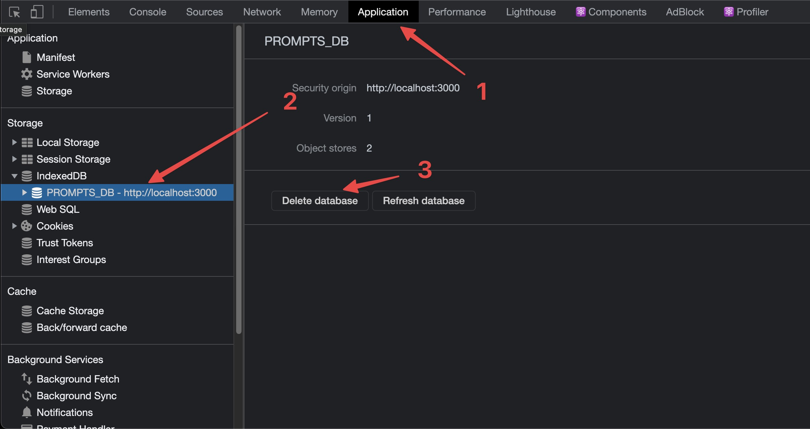

### About
Pengineer (prompt engineer) is a small NextJS application to help create prompts for OpenAI.

### Usage
Add your prompt and its elated completion to the textareas. The prompt/completion pair saves to the selected list. There's a default list and you can create additional.

### Download format
This application creates a [JSON Line](https://jsonlines.org/) formatted file that's compatible with how OpenAI fine-tunes models. More information on that [here](https://beta.openai.com/docs/guides/fine-tuning/prepare-training-data).


### Installation

```
yarn install
```

### Development mode

```
yarn dev
```

### Security details

- All information is persisted to the browser's storage using [IndexedDB](https://developer.mozilla.org/en-US/docs/Web/API/IndexedDB_API).
- Prompts are not sent to any remote backend.
- To delete your information, open Chrome Developer Tools and follow steps in the below image.

